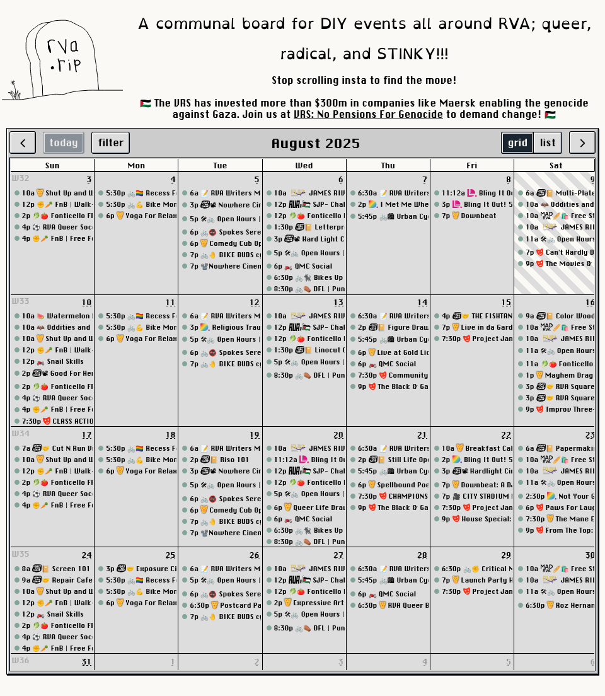
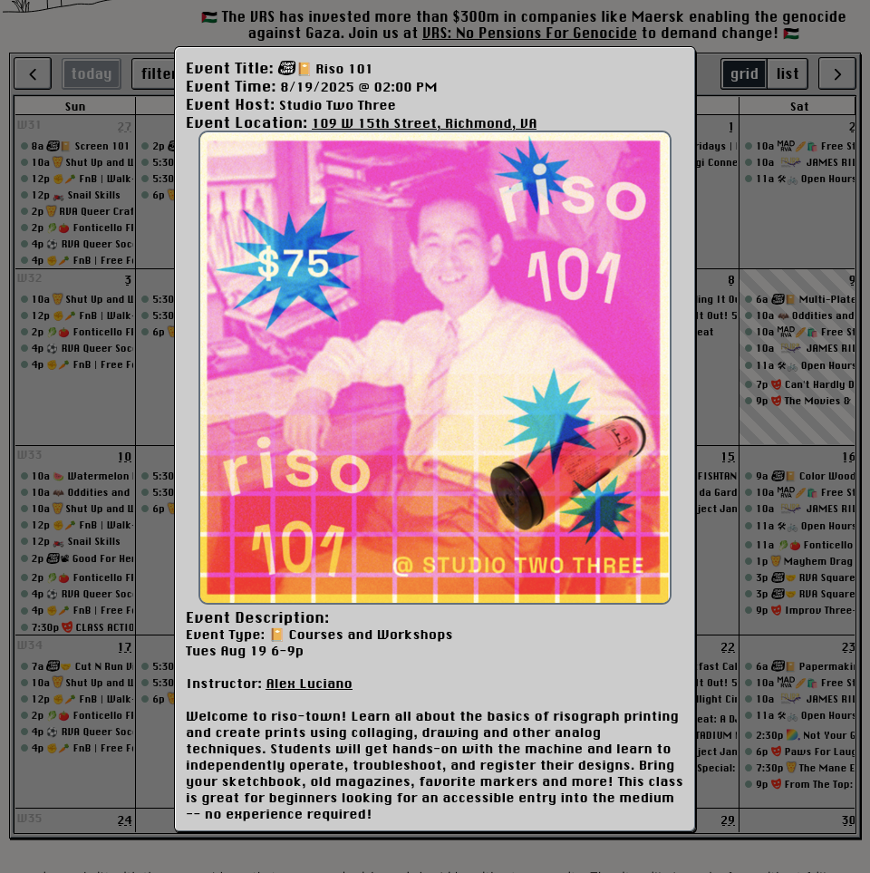

# rva.rip

## Mission Statement

> “Always bear in mind that the people are not fighting for ideas, for the things in anyone’s head. They are fighting to win material benefits, to live better and in peace, to see their lives go forward, to guarantee the future of their children.”

**[― Amilcar Cabral](https://www.marxists.org/subject/africa/cabral/1965/tnlcnev.htm)**
 Guinea-Bissauan and Cape Verdean agricultural engineer, poet, and Pan-African Revolutionary

This project's purpose is to assist in building a better and more vibrant community with the people of Richmond; with the hope that one day it can help build to greater change :)

## How do I add my events to this website?

You have two options!

    1. Email me at host@rva.rip with a Google Calendar you'd like to share :)
    2. Fork this project and open a pull request with your changes added to ~~/assets/event_sources.json

todo: make this into a page on rva.rip so it's more accessible

## Local Quickstart

If you want to run the entire application locally, visit [QUICKSTART.md](QUICKSTART.md).

## How do I fork this and host it for my city?

`~~/components/App.vue` is the entry point for this website, and in order to get a MVP for you to test yourself you simply have to find where `const endpoints` is defined and comment out all the APIs inside the function. Keep in mind this is simply my workflow, but some more defined steps are below:

- I recommend using one of these text editors with this project: `vscode` or `vscodium` (available on Windows, Linux, Mac)
- Install the application. See [QUICKSTART.md](QUICKSTART.md).
- Search for `const endpoints`'s definition in App.vue and comment out all the APIs in order to stop them from loading.
- Copy `sample.env` into a new file named simply `.env` in the root folder and try and fill out as many of the keys as possible, or as is desired for the scope of your project.
- Fill out `~~/assets/event_sources.json` with all of the feeds you'd like to capture
- Begin modifying `const endpoints` again to start uncommenting the APIs you want to target one by one to ensure they work completely
  - In my experience it's completely normal for your event grabbing to work and it not show visually on a local dev preview environment, so if you can get Vercel up and running try and open a development branch and publish your changes there to see if it'll work in a real world environment. There may be better ways to do this but I'm just a lady trying her best with computers.
- When you are finished and satisfied with your code (or want to start getting ready to target production) begin connecting your github repo with Vercel, I'm shocked at how easy it was, leave all the settings at default except to make sure that Vercel knows this repository is targetting the Nuxt framework. Add the environment variables and bing bong so simple you should be done! Behold your labors and maybe add a domain.

## Screenshots

